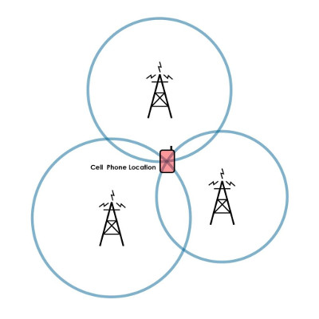

# Documentacion de Challenge

## SWAGGER:

OpenAPI: [Swagger](http://localhost:8080/swagger/views/swagger-ui/index.html)
(Este link requiere que el servicio este corriendo)


http://localhost:8080/swagger/views/swagger-ui/index.html


# El procedimiento es el siguiente:

- Se obtiene la ubicacion de cada satelite (por default se inicializan en la ubicacion especificacda).

- A medida que se van interceptando mensajes, estos se almacenena (en este caso en una "inMemory DB")

- Cuando se logro decifrar el mensaje, se intenta localizar la ubicacion del emisor del mismo

- si es posible obtner los 2 datos (mensaje, ubicacion) se retornan , en caso contrario retorna un HTTP 404


## Mensaje

## Assumtions:

### Desfasaje: 
 Se asume que el desfasaje esta al principio del mensaje, nunca en el medio o al final

Ej: Desfasaje no contemplado
```bash
 Kenobi: ​   ["este", "es",   "", "mensaje"]
 Skywalker: ​["",       "", "un", "mensaje"]
 Sato: ​     ["",       "",   "", "mensaje", "", "", ""]
```


## Calculo que ubicacion

Para descubrir la ubicacion del emisor, se intenta triangular la señal usando las ubicaciones de los 3 satelites.



Para triangular, necesitamos al menos 3 puntos fijos, aca hay un ejemplo de como se calcula:


1. Los circulos se crean a partir de la ubicacion del satelite y la distancia detectada por el mismo al momento de interceptar el mensaje (esa distancia fue previamente almacenada en la DB cuando se interceptó el mensaje)


2. Vamos a tener 3 circulos (uno por cada satelite):
- centro: la ubicacion del satelite
- radio : la distancia del mensaje interceptado

3. luego se buscan los punto de inteseccion entre los circulos:

 - intersectionPoints01 =  puntos de inteseccion entre el circulo0 y circulo1 

 - intersectionPoints12. busco los puntos de inteseccion entre el circulo1 y circulo2

 - ubicacion =  luego busco un punto en comun de las intersecciones (intersectionPoints01 & intersectionPoints12)

- si ubicacion != null ... encontre el punto

